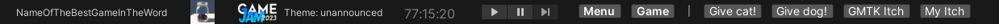
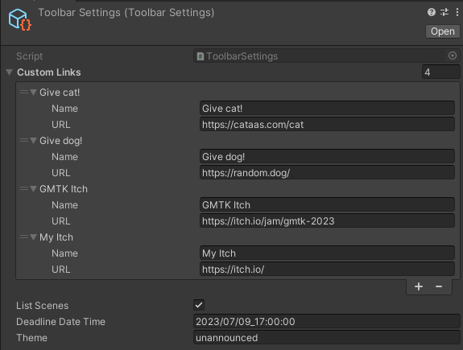

# GMTK Death Clock

- Name of your game
- Icon of your game
- GMTK branding
- Theme
- Time till deadline
- List of Scenes from BuildSettings
- Links
  - By default including a random cat and dog links <3

# Customize it!

- Add as many custom links you need
- Disable the scene links
- fill in the theme
- adjust the deadline (if there's a postpone)

# Install
- Open Unity Package Manager
- Add from git
- `https://github.com/kipash/GMTK-DeathClock.git` (don't forget the .git at the end)

## Settings file creation
- Everything should setup itself when the toolbar is displayed
- A new ToolbarSettings scriptable object should apper at `Assets/`, you can move it anywhere you want.

# Credits
- I bastardized this Toolbar GUI hook: https://github.com/smkplus/CustomToolbar